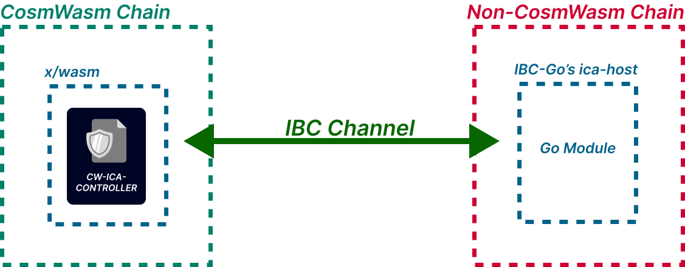

# Secret ICA Controller Contract

<div align="center">

  [](https://github.com/srdtrk/cw-ica-controller/tree/main/e2e)
  [](https://github.com/srdtrk/cw-ica-controller/releases/latest)
  [](https://github.com/srdtrk/cw-ica-controller/blob/main/LICENSE)
  [](https://github.com/srdtrk/cw-ica-controller)
</div>



This is a CosmWasm smart contract that communicates with the golang `ica/host` module on the counterparty chain to create and manage **one** interchain account. This contract can also execute callbacks based on the result of the interchain account transaction. Because this is a CosmWasm implementation of the entire ICA controller, the chain that this contract is deployed on need **not** have the ICA module enabled. Moreover, the counterparty chain need not have CosmWasm support.

**This branch is ported to Secret Network, using a forked version of CosmWasm.**

**A documentation website for this contract is [here](https://srdtrk.github.io/cw-ica-controller/).**

This contract now supports both `proto3json` and protobuf encoding/decoding for ICA transactions. **The recommended encoding is protobuf.** If no encoding is specified, then the contract will default to protobuf encoding.

## Table of Contents

- [CosmWasm ICA Controller Contract](#cosmwasm-ica-controller-contract)
  - [Table of Contents](#table-of-contents)
  - [Usage](#usage)
    - [Create an interchain account](#create-an-interchain-account)
      - [Using `InstantiateMsg` and/or `ExecuteMsg::CreateChannel`](#using-instantiatemsg-andor-executemsgcreatechannel)
      - [Using the Relayer](#using-the-relayer)
    - [Execute an interchain account transaction](#execute-an-interchain-account-transaction)
      - [`SendCosmosMsgs` (recommended)](#sendcosmosmsgs-recommended)
      - [`SendCustomIcaMessages`](#sendcustomicamessages)
    - [Execute a callback](#execute-a-callback)
    - [Channel Closing and Reopening](#channel-closing-and-reopening)
  - [Demo](#demo)
  - [Testing](#testing)
    - [Unit tests](#unit-tests)
    - [End to end tests](#end-to-end-tests)
  - [Releases](#releases)
  - [Limitations](#limitations)
  - [Acknowledgements](#acknowledgements)

## Usage

The following is a brief overview of the contract's functionality. (You can also see the various ways this contract can be used in the end to end tests in the `e2e` directory.)

### Create an interchain account

This contract provides two ways to create an interchain account:

1. Using `InstantiateMsg`
2. Using `ExecuteMsg::CreateChannel`

#### Using `InstantiateMsg`

**This contract only accepts `MsgChannelOpenInit` messages sent by itself. Relayers can never initiate a channel handshake with this contract.**

`InstantiateMsg` always initiates the channel handshake and this is why `channel_open_init_options` field is not optional.

```rust, ignore
/// The message to instantiate the ICA controller contract.
#[cw_serde]
pub struct InstantiateMsg {
    /// The address of the owner of the ICA application.
    /// If not specified, the sender is the owner.
    #[serde(skip_serializing_if = "Option::is_none")]
    pub owner: Option<String>,
    /// The options to initialize the IBC channel upon contract instantiation.
    pub channel_open_init_options: options::ChannelOpenInitOptions,
    /// The contract address that the channel and packet lifecycle callbacks are sent to.
    /// If not specified, then no callbacks are sent.
    #[serde(skip_serializing_if = "Option::is_none")]
    pub send_callbacks_to: Option<String>,
}
```

#### Using `ExecuteMsg::CreateChannel`

If the `channel_open_init_options` field in `InstantiateMsg` was malformed in a way that prevents the channel handshake from succeeding, the contract owner can submit a `ExecuteMsg::CreateChannel` with a new `channel_open_init_options`.

```rust, ignore
pub enum ExecuteMsg {
    /// `CreateChannel` makes the contract submit a stargate MsgChannelOpenInit to the chain.
    /// This is a wrapper around [`options::ChannelOpenInitOptions`] and thus requires the
    /// same fields. If not specified, then the options specified in the contract instantiation
    /// are used.
    CreateChannel {
        /// The options to initialize the IBC channel.
        /// If not specified, the options specified in the contract instantiation are used.
        /// Must be `None` if the sender is not the owner.
        #[serde(skip_serializing_if = "Option::is_none")]
        channel_open_init_options: Option<options::ChannelOpenInitOptions>,
    },

    // ...
}
```

In case the channel was closed due to a timeout, the contract owner can submit a `ExecuteMsg::CreateChannel` with `channel_open_init_options: None` to create a channel with the same `channel_open_init_options` as the last channel opening.
Learn more about channel closing and reopening [here](#channel-closing-and-reopening).

### Execute an interchain account transaction

This contract provides two APIs to send ICA transactions. The `ExecuteMsg::SendCustomIcaMessages` and `ExecuteMsg::SendCosmosMsgs` messages are used to commit a packet to be sent to the host chain.

#### `SendCosmosMsgs` (recommended)

In CosmWasm contracts, `CosmosMsg` are used to execute transactions on the chain that the contract is deployed on. In this contract, we use `CosmosMsg`s to execute transactions on the host chain. This is done by converting the `CosmosMsg`s to an ICA tx based on the encoding of the channel. The ICA tx is then sent to the host chain. The host chain then executes the ICA tx and sends the result back to this contract.

`SendCosmosMsgs` is the recommended way to send ICA transactions in this contract. This execute message allows the user to submit an array of [`cosmwasm_std::CosmosMsg`](https://github.com/CosmWasm/cosmwasm/blob/v1.5.0/packages/std/src/results/cosmos_msg.rs#L27) which are then converted by the contract to an atomic ICA tx.

```rust, ignore
pub enum ExecuteMsg {
    // ...

    /// `SendCosmosMsgs` converts the provided array of [`CosmosMsg`] to an ICA tx and sends them to the ICA host.
    /// [`CosmosMsg::Stargate`] and [`CosmosMsg::Wasm`] are only supported if the [`TxEncoding`](crate::ibc::types::metadata::TxEncoding) is [`TxEncoding::Protobuf`](crate::ibc::types::metadata::TxEncoding).
    ///
    /// **This is the recommended way to send messages to the ICA host.**
    SendCosmosMsgs {
        /// The stargate messages to convert and send to the ICA host.
        messages: Vec<CosmosMsg>,
        /// Optional memo to include in the ibc packet.
        #[serde(skip_serializing_if = "Option::is_none")]
        packet_memo: Option<String>,
        /// Optional timeout in seconds to include with the ibc packet.
        /// If not specified, the [default timeout](crate::ibc::types::packet::DEFAULT_TIMEOUT_SECONDS) is used.
        #[serde(skip_serializing_if = "Option::is_none")]
        timeout_seconds: Option<u64>,
    },

    // ...
}
```

Note that `SendCosmosMsgs` only supports `Stargate` and `Wasm` messages if the channel is using the protobuf encoding. This is because the `Stargate` and `Wasm` messages are converted to protobuf messages before being sent to the host chain. If the channel is using `proto3json` encoding, then the `Stargate` and `Wasm` messages are not supported.

(`Stargate` allows the user to submit any protobuf message to the host chain.)


Here is an example execute message that delegates tokens to a validator on the host chain and then votes on a proposal (atomically).

```json
{
  "send_cosmos_msgs":{
    "messages":[
      {
        "staking":{
          "delegate":{
            "validator":"validatorAddress",
            "amount":{
              "denom":"uatom",
              "amount":"10000000"
            }
          }
        }
      },
      {
        "gov":{
          "vote":{
            "proposal_id":1,
            "vote":"yes"
          }
        }
      }
    ]
  }
}
```

#### `SendCustomIcaMessages`

`SendCustomIcaMessages`: This message requires the sender to give base64 encoded messages that will be sent to the host chain. The host chain will decode the messages and execute them. The result of the execution is sent back to this contract, and a callback is executed based on the result.

This execute message is not recommended because it requires the user to know the encoding of the channel. If the user does not know the encoding of the channel, then they will not be able to submit the correct messages.
This execute message is only useful if the user wants to submit any arbitrary messages while using the `proto3json` encoding. (This is because `CosmosMsg::Stargate` is not supported if the channel is using `proto3json` encoding.)

If the channel is using `proto3json` encoding, then the format that json messages have to take are defined by the cosmos-sdk's json codec. The following is an example of a json message that is submitting a text legacy governance: (In this example, the `proposer` is the address of the interchain account on the host chain)

```json
{
  "messages": [
    {
      "@type": "/cosmos.gov.v1beta1.MsgSubmitProposal",
      "content": {
        "@type": "/cosmos.gov.v1beta1.TextProposal",
        "title": "IBC Gov Proposal",
        "description": "tokens for all!"
      },
      "initial_deposit": [{ "denom": "stake", "amount": "5000" }],
      "proposer": "cosmos1k4epd6js8aa7fk4e5l7u6dwttxfarwu6yald9hlyckngv59syuyqnlqvk8"
    }
  ]
}
```

If the channel is using `proto3` (protobuf) encoding, then the format that protobuf messages have to take are defined by the cosmos-sdk's protobuf codec. Protobuf messages do not have nice human readable formats like json messages do. In the rust the `cosmos-sdk-proto` library is used to generate the protobuf messages as follows:

```rust, ignore
use cosmos_sdk_proto::{
    cosmos::{bank::v1beta1::MsgSend, base::v1beta1::Coin},
    traits::MessageExt,
};

// ...

let predefined_proto_message = MsgSend {
    from_address: ica_info.ica_address,
    to_address,
    amount: vec![Coin {
        denom: "stake".to_string(),
        amount: "100".to_string(),
    }],
};

IcaPacketData::from_proto_anys(predefined_proto_message.to_any()?);
```

where `from_proto_anys` is defined as:

```rust, ignore
pub use cosmos_sdk_proto::ibc::applications::interchain_accounts::v1::CosmosTx;

// ...

/// Creates a new IcaPacketData from a list of [`cosmos_sdk_proto::Any`] messages
pub fn from_proto_anys(messages: Vec<cosmos_sdk_proto::Any>, memo: Option<String>) -> Self {
    let cosmos_tx = CosmosTx { messages };
    let data = cosmos_tx.encode_to_vec();
    Self::new(data, memo)
}
```

And in golang [(see e2e tests)](./e2e/interchaintest/types/contract_msg.go) we use the `SerializeCosmosTxWithEncoding` from ibc-go to encode the protobuf messages where encoding is either `proto3` or `proto3json`:

```go
// NewSendCustomIcaMessagesMsg creates a new SendCustomIcaMessagesMsg.
func NewSendCustomIcaMessagesMsg(cdc codec.BinaryCodec, msgs []proto.Message, encoding string, memo *string, timeout *uint64) string {
	type SendCustomIcaMessagesMsg struct {
		Messages       string  `json:"messages"`
		PacketMemo     *string `json:"packet_memo,omitempty"`
		TimeoutSeconds *uint64 `json:"timeout_seconds,omitempty"`
	}

	type SendCustomIcaMessagesMsgWrapper struct {
		SendCustomIcaMessagesMsg SendCustomIcaMessagesMsg `json:"send_custom_ica_messages"`
	}

	bz, err := icatypes.SerializeCosmosTxWithEncoding(cdc, msgs, encoding)
	if err != nil {
		panic(err)
	}

	messages := base64.StdEncoding.EncodeToString(bz)

	msg := SendCustomIcaMessagesMsgWrapper{
		SendCustomIcaMessagesMsg: SendCustomIcaMessagesMsg{
			Messages:       messages,
			PacketMemo:     memo,
			TimeoutSeconds: timeout,
		},
	}

	jsonBytes, err := json.Marshal(msg)
	if err != nil {
		panic(err)
	}

	return string(jsonBytes)
}
```

### Execute a callback

This contract supports external contract callbacks. See [`src/types/callbacks.rs`](./src/types/callbacks.rs) to learn what callbacks are supported.
This contract currently only supports sending callbacks to a single contract. You register the callback contract address during instantiation, or update it later using `ExecuteMsg::UpdateCallbackAddress`.

The callback contract must include the following variant in its `ExecuteMsg` enum:

```rust, ignore
use cosmwasm_schema::cw_serde;
use cw_ica_controller::types::callbacks::IcaControllerCallbackMsg;

#[cw_serde]
pub enum ExecuteMsg {
    // ... other variants

    /// The callback message from the ICA controller contract.
    ReceiveIcaCallback(IcaControllerCallbackMsg),
}
```

Any contract that imports the `cw-ica-controller` as a library needs to disable the `default-features` of the `cw-ica-controller` crate.
This is because the `default-features` of the `cw-ica-controller` crate includes the CosmWasm entry points.

```toml
[dependencies]
cw-ica-controller = { version = "0.3.0", default-features = false }
```

### Channel Closing and Reopening

#### Channel Closing

An ICA channel can be closed due to a timed out packet if the channel is ordered.
Otherwise, the channel can be closed by the user by submitting a `ExecuteMsg::CloseChannel` message.

#### Channel Reopening

If the ICA channel is closed, the contract is then able to create a new channel with the same interchain account address, and continue to use the same interchain account. To do this, you submit a `ExecuteMsg::CreateChannel`.
Note that the `channel_open_init_options` can be changed when creating a new channel.
This is useful if the user wants to change the ordering of the channel.

## Demo

This project was used in the Injective Illuminate hackathon winner project [Tokenized Interchain Accounts](https://dorahacks.io/buidl/8513) where each NFT controls an interchain account. The following is a demo of the project:

<div align="center">
  <a href="https://www.loom.com/share/4e85206379354f5182d21d8e384aba74">
    <p>Tokenized Interchain Accounts Demo - Watch Video</p>
  </a>
  <a href="https://www.loom.com/share/4e85206379354f5182d21d8e384aba74">
    
  </a>
</div>

## Testing

There are two kinds of tests in this repository: unit tests and end to end tests. The unit tests are located inside the rust files in the `src` directory. The end to end tests are located in the `e2e` directory.

### Unit tests

In general, the unit tests are for testing the verification functions for the handshake, and for testing that the serializers and deserializers are working correctly. To run the unit tests, run `cargo test`.

### End to end tests

The end to end tests are for testing the contract's functionality in an environment mimicking production. To see whether or not it can perform the channel handshake, send packets, and execute callbacks. We achieve this by running two local chains, one for the contract, and one for the host chain. The relayer is then used to perform the channel handshake, and send packets. The contract then executes callbacks based on the result of the packet. To learn more about the end to end tests, see the [Readme](./e2e/Readme.md) in the `e2e` directory.

## Releases

This contract follows [semantic versioning](https://semver.org/), but with the following deviations:

- A major version will not be tagged until the contract is audited.
- Any API breaking changes or state-machine breaking changes will result in a minor version bump.

## Limitations

This contract is not meant to be used in production. It is meant to be used as a reference implementation for how to build a CosmWasm contract that can communicate with the golang ica/host module. The following are some of the limitations of this contract:

- The contract cannot create multiple interchain accounts. It can only create one.

## Acknowledgements

Much thanks to [Art3mix](https://github.com/Art3miX) and [CyberHoward](https://github.com/CyberHoward) for all the helpful discussions. Also thanks to [0xekez](https://github.com/0xekez) for their work on [cw-ibc-example](https://github.com/0xekez/cw-ibc-example) which was a great reference for CosmWasm IBC endpoints and interchaintest.
